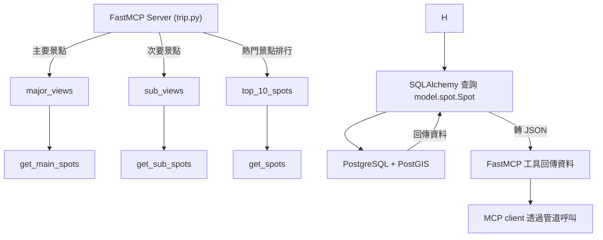

# MCP 流程圖

這份圖示說明了 `trip.py` 中 FastMCP 服務器啟動與各項工具處理的完整流程，方便開發或整合時快速理解資料如何流動。

```mermaid
flowchart TD
    A["FastMCP Server (trip.py)"] -->|主要景點| B[major_views]
    A -->|次要景點| C[sub_views]
    A -->|熱門景點排行| D[top_10_spots]

    B --> E[get_main_spots ]
    C --> F[get_sub_spots ]
    D --> G[get_spots ]

    H --> I[SQLAlchemy 查詢 model.spot.Spot]
    I --> J[PostgreSQL + PostGIS]
    J -->|回傳資料| I
    I -->|轉 JSON| K[FastMCP 工具回傳資料]
    K --> L[MCP client 透過管道呼叫]
```
